\# Report for Assignment 1

\## Project chosen

**Name:** plotly.py

**URL:**
\[https://github.com/emelcin/plotly.py\](https://github.com/emelcin/plotly.py)

**Number of lines of code and the tool used to count it:** 384,239 lines
(measured using \`cloc\`)

**Programming language:** Python

\## Coverage measurement

\### Existing tool

**Execution:** To measure code coverage, the \`Coverage.py\` tool was
used. The tool was executed using the following commands: \`\`\`coverage
run \--branch -m pytest coverage report -m coverage html open
htmlcov/index.html

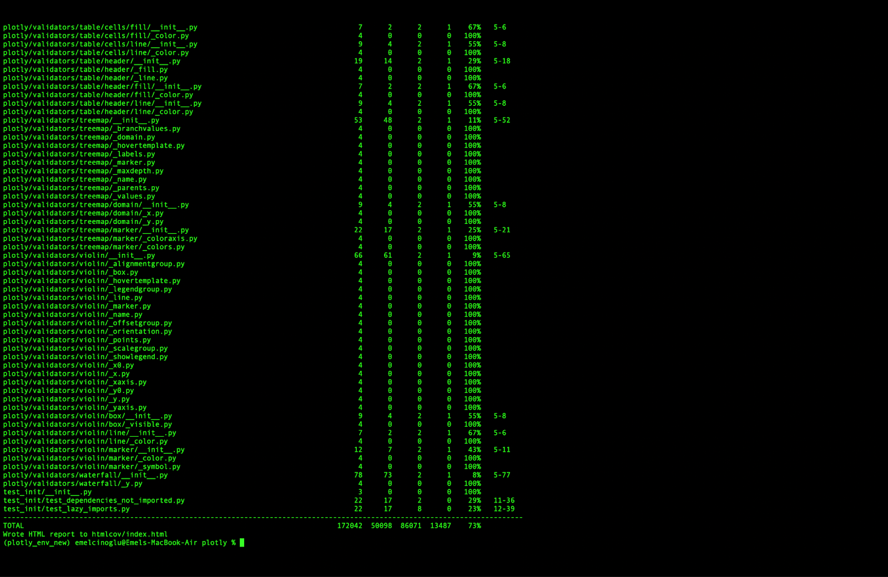{width="7.521874453193351in"
height="4.897964785651793in"}

\### Your own coverage tool

**Emel Dzhinoglu:**

**Function1: \_vectorize_zvalue**

**Commit made in forked repository that shows the instrumented code:**

[[https://github.com/emelcin/plotly.py/commit/bf954cb231c7fd6065f63d4bdb5340c0411badae]{.underline}](https://github.com/emelcin/plotly.py/commit/bf954cb231c7fd6065f63d4bdb5340c0411badae)

**Screenshot of the coverage results output by the instrumentation:**

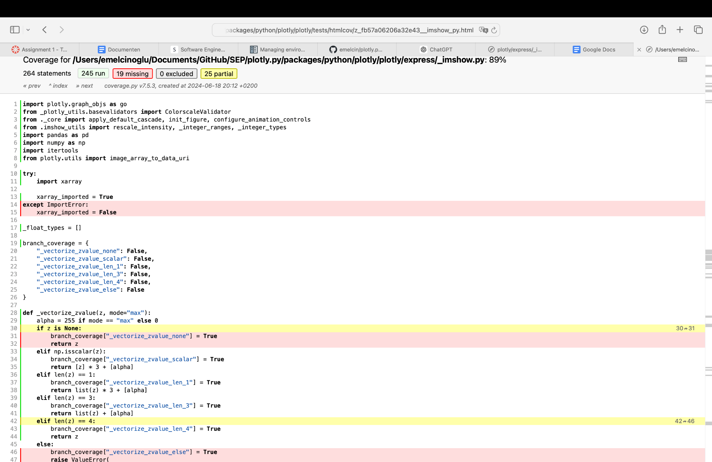{width="6.390625546806649in"
height="3.7109962817147855in"}

**Function2: annotation_dict_for_label**

**Commit made in forked repository that shows the instrumented code:**

[**[https://github.com/emelcin/plotly.py/compare/bf954cb231c7fd6065f63d4bdb5340c0411badae\...59d83806134e48a387631dd21f0786bfca5c91c7]{.underline}**](https://github.com/emelcin/plotly.py/compare/bf954cb231c7fd6065f63d4bdb5340c0411badae...59d83806134e48a387631dd21f0786bfca5c91c7)

**Screenshot of the coverage results output by the instrumentation:**

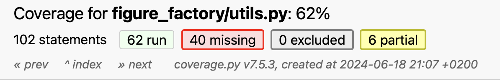{width="5.1712959317585305in"
height="0.832830271216098in"}

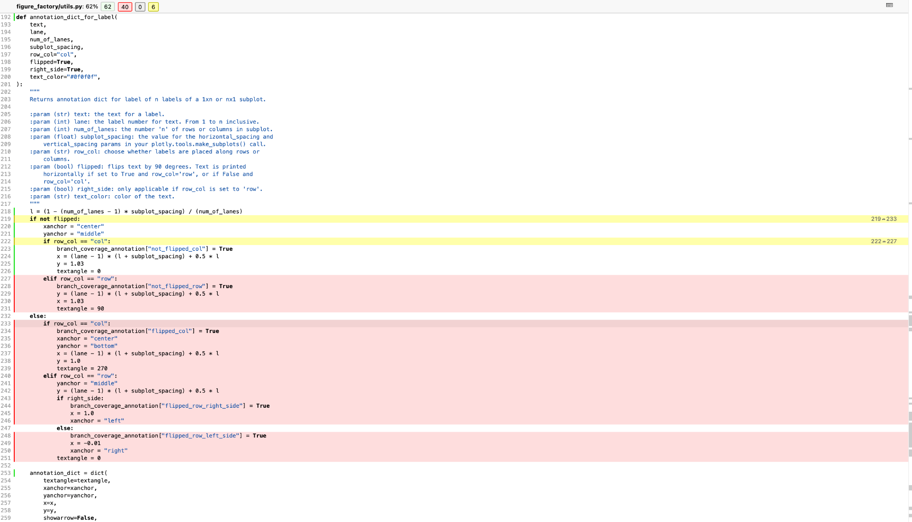{width="6.267716535433071in"
height="3.5972222222222223in"}

**Poyraz Temiz**

**Function1:** is_source_key(key) from *chart_studio\\utils.py*

**Commit made in forked repository that shows the instrumented code:**

**[[https://github.com/plotly/plotly.py/commit/399c3d4f620d0267b7a69385124edd443f169528]{.underline}](https://github.com/plotly/plotly.py/commit/399c3d4f620d0267b7a69385124edd443f169528)**

**Screenshot of the coverage results output by the instrumentation:**

> 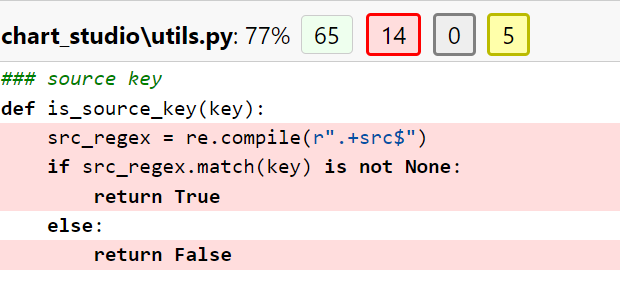{width="6.267716535433071in"
> height="3.013888888888889in"}

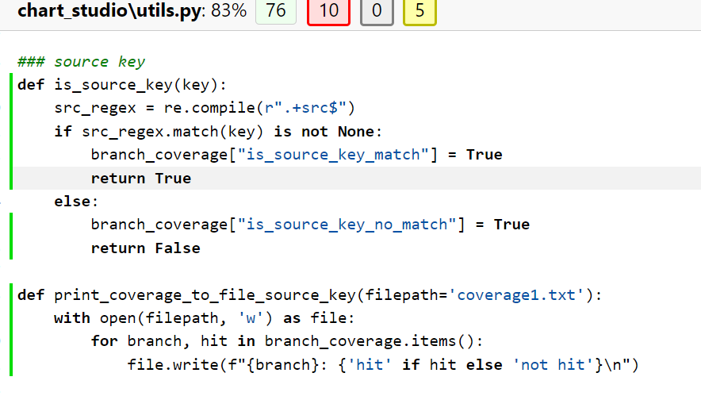{width="6.267716535433071in"
height="3.5416666666666665in"}

**Function2:** update_session_plot_options(\*\*kwargs ) from
*chart_studio\\session.py*

**Commit made in forked repository that shows the instrumented code:**

**[[https://github.com/plotly/plotly.py/commit/d8bd4b6b581b478881e0151d7209c77f29a861ff]{.underline}](https://github.com/plotly/plotly.py/commit/d8bd4b6b581b478881e0151d7209c77f29a861ff)**

**Screenshot of the coverage results output by the instrumentation:**

> 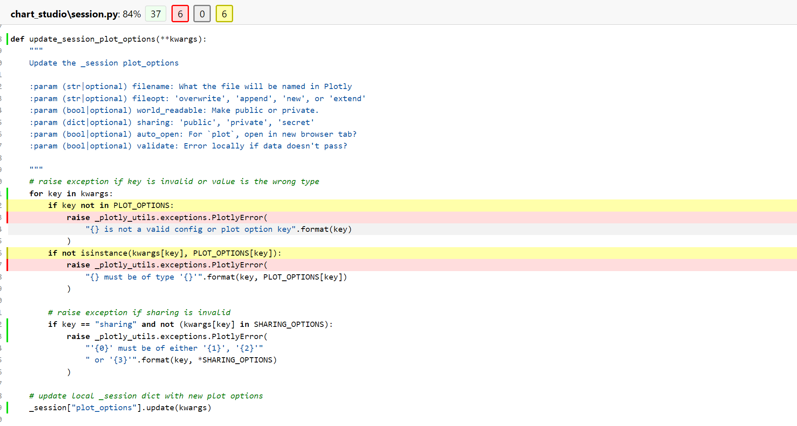{width="3.7239588801399823in"
> height="2.981023622047244in"}

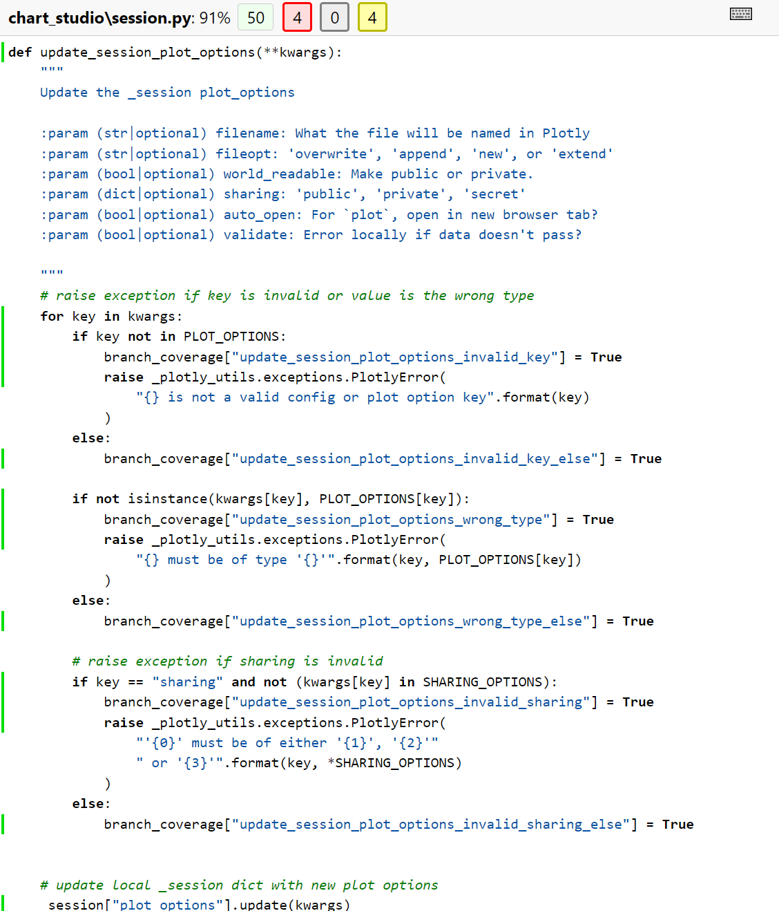{width="4.812396106736658in"
height="5.619792213473316in"}

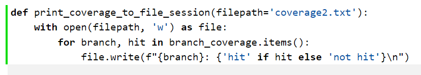{width="6.267716535433071in" height="1.125in"}

**Georgi Ivanov**

**Function1: should_retry**

**Commit made in forked repository that shows the instrumented code:**
[[https://github.com/plotly/plotly.py/compare/master\...emelcin:plotly.py:georgi]{.underline}](https://github.com/plotly/plotly.py/compare/master...emelcin:plotly.py:georgi)

**Screenshot of the coverage results output by the tool:**

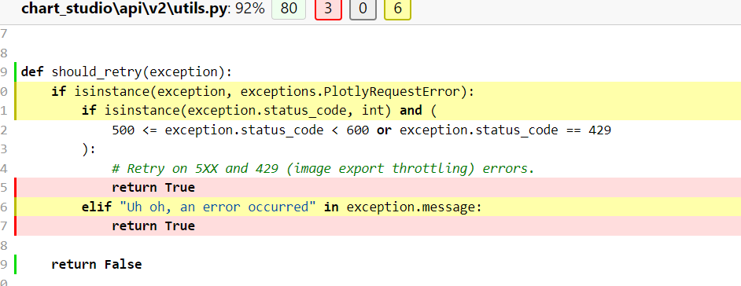{width="6.267716535433071in"
height="2.4166666666666665in"}

**Function2:** **sign_in()**

**Commit made in forked repository that shows the instrumented code:**

[[https://github.com/plotly/plotly.py/compare/master\...emelcin:plotly.py:georgi]{.underline}](https://github.com/plotly/plotly.py/compare/master...emelcin:plotly.py:georgi)

**Screenshot of the coverage results output by the tool:**

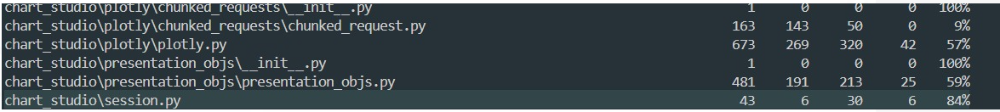{width="6.267716535433071in"
height="0.7083333333333334in"}

**Selin Lal Saracoglu**

**Function1: \_list_repr_elided**

**Commit made in forked repository that shows the instrumented code:**

[[https://github.com/plotly/plotly.py/commit/a4fc88fd3929e66da8687bfbb760129c8f57be2e]{.underline}](https://github.com/plotly/plotly.py/commit/a4fc88fd3929e66da8687bfbb760129c8f57be2e)

**Screenshot of the coverage results output by the instrumentation:**

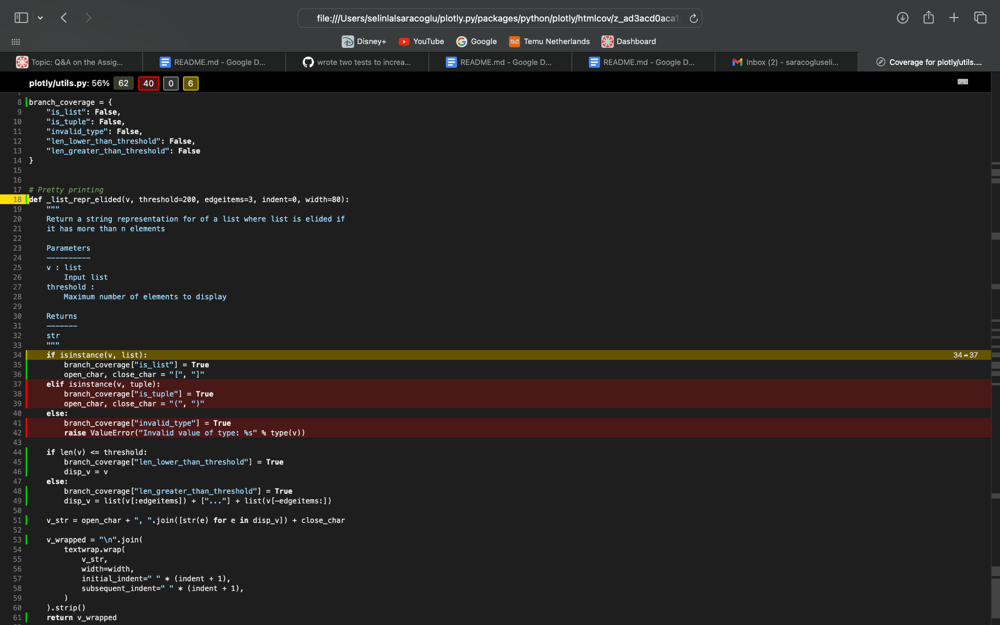{width="5.790108267716535in"
height="3.2123873578302713in"}

**Function2:** **\_replace_newline**

**Commit made in forked repository that shows the instrumented code:**

[[https://github.com/plotly/plotly.py/commit/a4fc88fd3929e66da8687bfbb760129c8f57be2e]{.underline}](https://github.com/plotly/plotly.py/commit/a4fc88fd3929e66da8687bfbb760129c8f57be2e)

**Screenshot of the coverage results output by the instrumentation:**

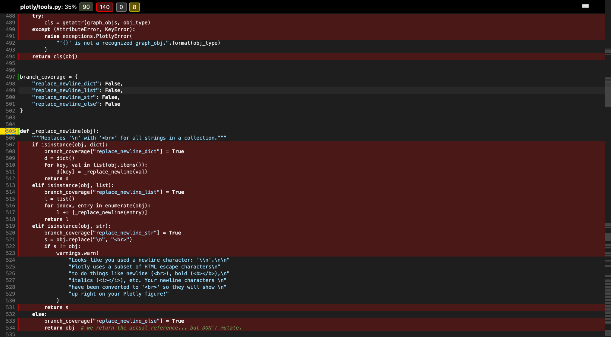{width="5.703125546806649in"
height="3.1395056867891515in"}

\## Coverage improvement

\### Individual tests

**Emel Dzhinoglu**:

**Test1: test_vectorize_zvalue.py:**

**Commit made in forked repository that shows the new test:**

[[https://github.com/emelcin/plotly.py/commit/bf954cb231c7fd6065f63d4bdb5340c0411badae]{.underline}](https://github.com/emelcin/plotly.py/commit/bf954cb231c7fd6065f63d4bdb5340c0411badae)

**Old coverage result:**

{width="5.192708880139983in"
height="3.052801837270341in"}

**New coverage
result:**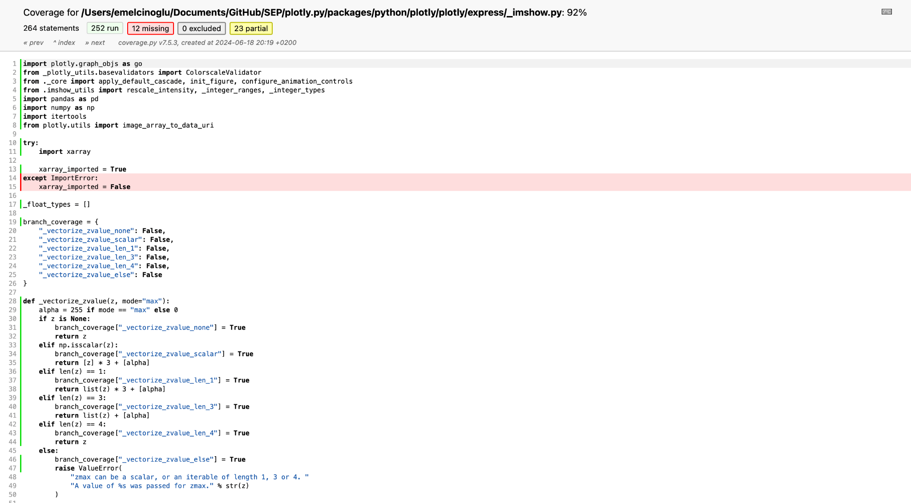{width="5.567708880139983in"
height="3.055449475065617in"}

The code coverage improved by 3%, from 89% to 92%, due to the addition
of new tests in the commit. These tests cover previously untested code
paths, increasing the overall test coverage.

**Test2: test_annotation_dic_for_label.py:**

**Commit made in forked repository that shows the new test:**

[[https://github.com/emelcin/plotly.py/compare/bf954cb231c7fd6065f63d4bdb5340c0411badae\...59d83806134e48a387631dd21f0786bfca5c91c7]{.underline}](https://github.com/emelcin/plotly.py/compare/bf954cb231c7fd6065f63d4bdb5340c0411badae...59d83806134e48a387631dd21f0786bfca5c91c7)

**Old coverage result:**

{width="3.2656255468066493in"
height="0.5248326771653543in"}{width="5.651042213473316in"
height="2.907630139982502in"}

**New coverage result:**

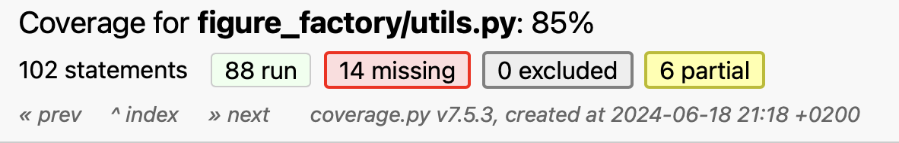{width="2.9531255468066493in"
height="0.48053805774278213in"}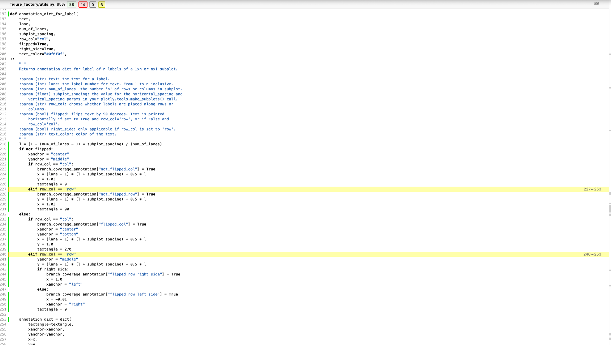{width="5.713542213473316in"
height="2.6041666666666665in"}

The code coverage improved by 23%, from 62% to 85%, due to the addition
of new tests in the commit. These tests cover previously untested code
paths, increasing the overall test coverage.

**Poyraz Temiz**

**Test1:** is_source_key(key) from *chart_studio\\utils.py*

**Commit made in forked repository that shows the new test:**

**[[https://github.com/emelcin/plotly.py/commit/1b7215cee9643c37827703bc68d6b27cbb45862d]{.underline}](https://github.com/emelcin/plotly.py/commit/1b7215cee9643c37827703bc68d6b27cbb45862d)**

> **Old coverage result:**
>
> {width="6.267716535433071in"
> height="3.013888888888889in"}

**New coverage result:**

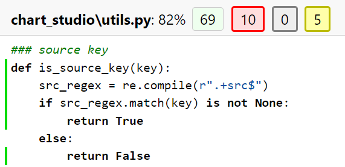{width="5.947916666666667in"
height="2.8854166666666665in"}

Branch coverage was 0% as this function was not tested before. However,
now, it has been increased to 100%.

**Test2:** update_session_plot_options(\*\*kwargs )from
chart_studio\\session.py

> **Commit made in forked repository that shows the new test:**
>
> **[[https://github.com/emelcin/plotly.py/commit/1b7215cee9643c37827703bc68d6b27cbb45862d]{.underline}](https://github.com/emelcin/plotly.py/commit/1b7215cee9643c37827703bc68d6b27cbb45862d)**
>
> **Old coverage result:**
>
> {width="4.171875546806649in"
> height="3.3448512685914262in"}
>
> **New coverage result:**

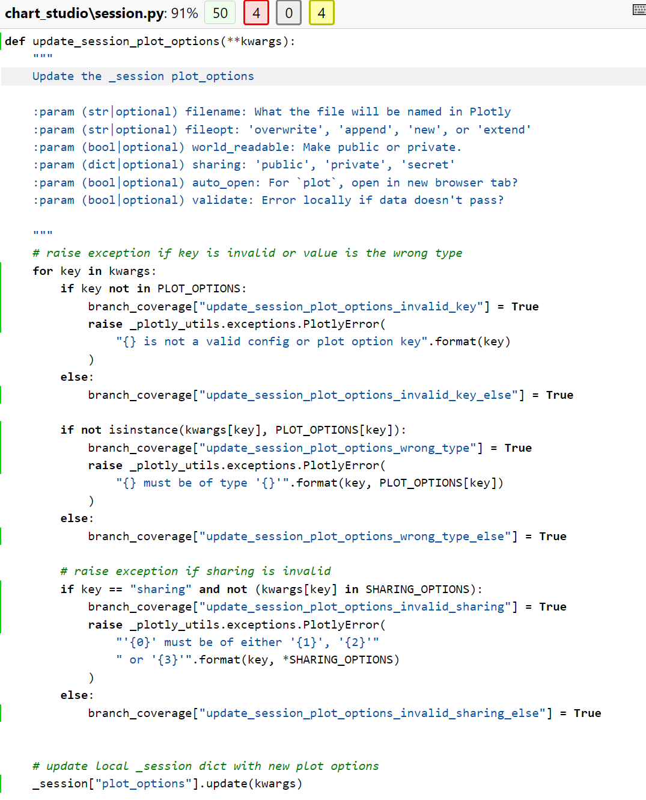{width="4.033056649168854in"
height="4.984375546806649in"}

Before, as there were 2 if statements that were untested, the branch
coverage was around 66% (by counting the invisible else cases as well).
However, now, the branch coverage is 100% as all branches, including the
invisible else cases, are tested.

**Georgi Ivanov**:

**Test1 should_retry():**

**Commit made in forked repository that shows the new test:**
[[https://github.com/plotly/plotly.py/compare/master\...emelcin:plotly.py:georgi]{.underline}](https://github.com/plotly/plotly.py/compare/master...emelcin:plotly.py:georgi)

**Old coverage result:**

{width="4.775539151356081in"
height="1.8418580489938758in"}

**New coverage result:**

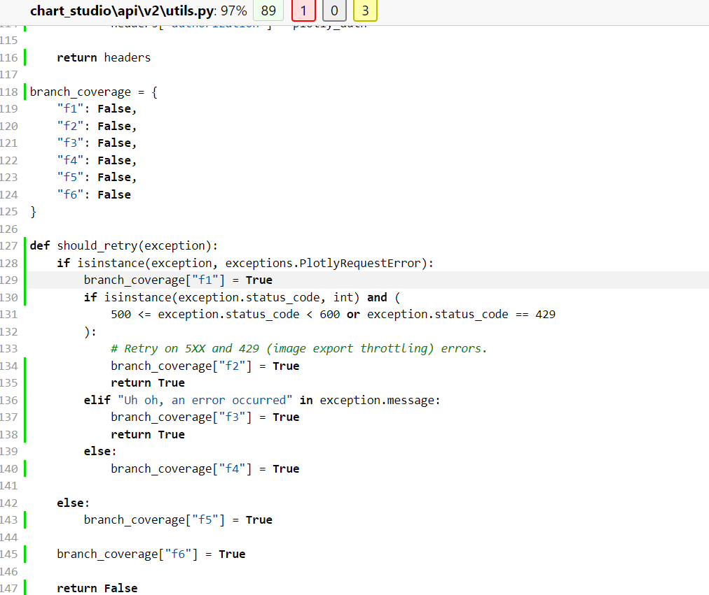{width="4.29166447944007in"
height="3.606732283464567in"}

**Test2:**

**Commit made in forked repository that shows the new test:**

[[https://github.com/plotly/plotly.py/compare/master\...emelcin:plotly.py:georgi]{.underline}](https://github.com/plotly/plotly.py/compare/master...emelcin:plotly.py:georgi)

**Old coverage result:**

{width="6.267716535433071in"
height="0.7083333333333334in"}

**New coverage result:**

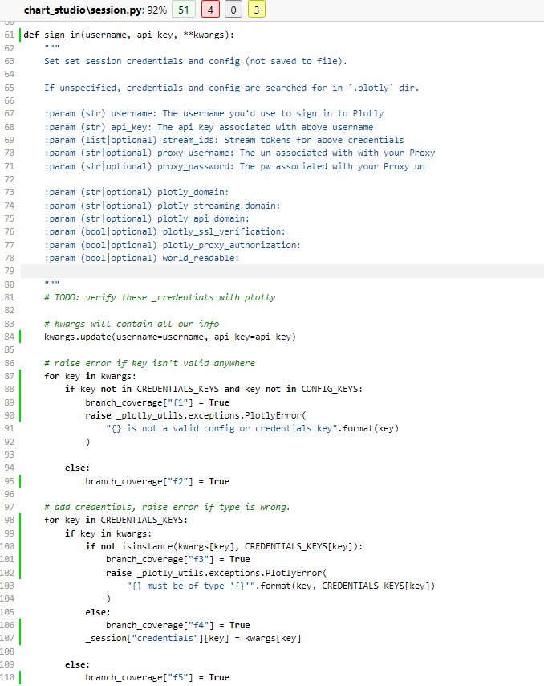{width="4.105824584426947in" height="5.15625in"}

**Selin Saracoglu**:

**Test1: \_list_repr_elided**

**Commit made in forked repository that shows the new test:**

[[https://github.com/plotly/plotly.py/commit/66f7203bbee0b23179cde6c7bf554e4d97f60065]{.underline}](https://github.com/plotly/plotly.py/commit/66f7203bbee0b23179cde6c7bf554e4d97f60065)

**Old coverage result:**

{width="5.609375546806649in"
height="3.1195997375328086in"}

**New coverage result:**

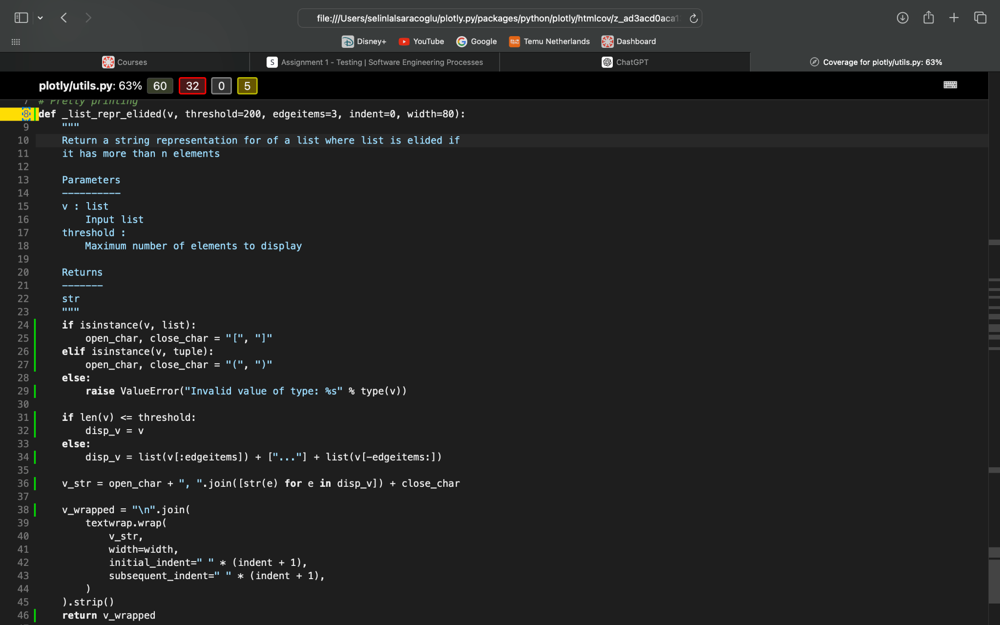{width="5.68898731408574in"
height="3.1563484251968505in"}

As seen above, the previous branch coverage was 33%, as only the first
if statement was covered. After the addition of tests, the branch
coverage increased to 100%.

**Test2: \_replace_new_line**

**Commit made in forked repository that shows the new test:**

[[https://github.com/plotly/plotly.py/commit/66f7203bbee0b23179cde6c7bf554e4d97f60065]{.underline}](https://github.com/plotly/plotly.py/commit/66f7203bbee0b23179cde6c7bf554e4d97f60065)

**Old coverage result:**

{width="5.689972659667542in"
height="3.128540026246719in"}

**New coverage result:**

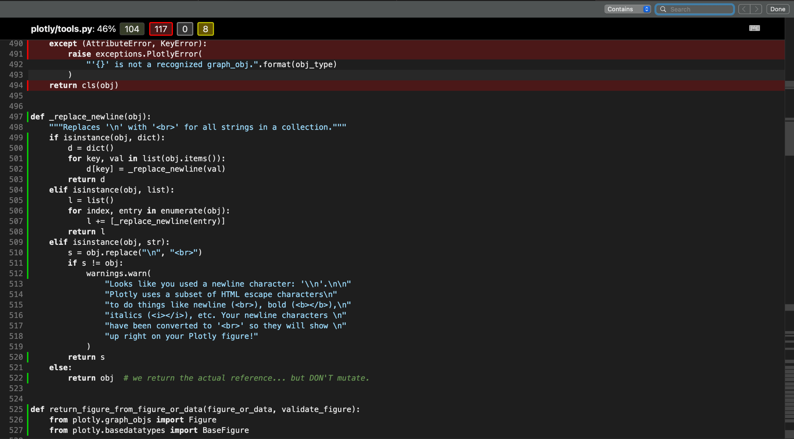{width="5.319851268591426in"
height="2.9427088801399823in"}

As seen above, the old branch coverage was 0% as none of the branches
are tested. After the addition of the tests, now the branch coverage is
100%.

\### Overall

**Old coverage result:**

{width="6.057292213473316in"
height="3.943112423447069in"}

**New coverage result:**

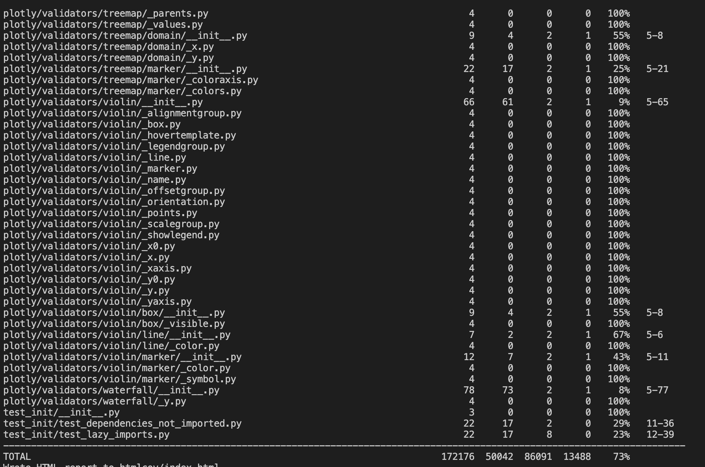{width="6.267716535433071in"
height="4.152777777777778in"}

\## Statement of individual contributions

Emel Dzhinoglu

-   Instrumented functions \_vectorize_zvalue and
    annotation_dict_for_label

-   Added tests for test_vectorize_zvalue.py and
    test_annotation_dic_for_label.py

Poyraz Temiz

-   Instrumented functions is_source_key(key) and
    update_session_plot_options(\*\*kwargs)

-   Added tests for is_source_key(key) and
    update_session_plot_options(\*\*kwargs)

Georgi Ivanov

-   Instrumented functions should_retry() and sign_in()

-   Updated the according test files by adding extra tests that cover
    the above-mentioned functions

Selin Saracoglu

-   Instrumented functions \_replace_new_line and \_list_repr_elided

-   Added tests for test_replace_new_line and test_list_repr_elided
